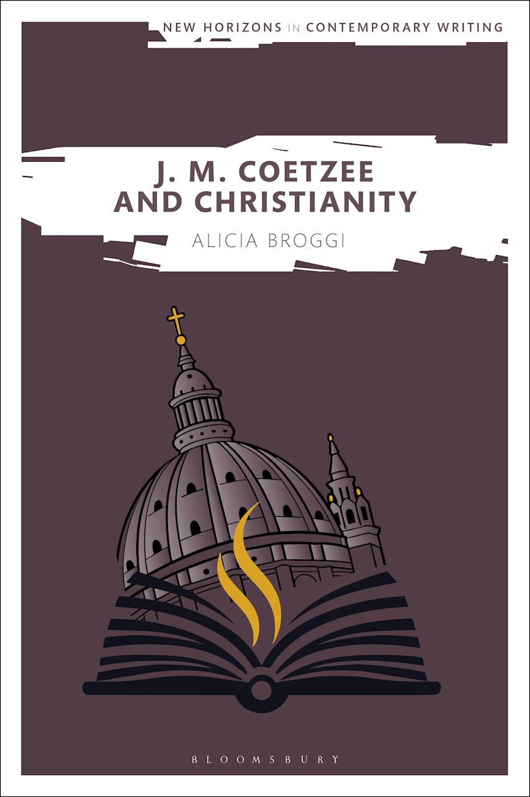

**Good writing is good thinking.** I am a writer, researcher, and editorial consultant who helps organizations make sense of complex, fast-moving cultural and technological landscapes.

My work spans peer-reviewed books on culture and belief, deep-dive feature profiles of engineering leaders, and analytical essays on socio-technical systems. Because I have spent years researching and teaching at the university level in the UK and Germany, as well as mentoring writers through independent research projects in the US, I know how to interrogate structural frameworks deeply—and, more importantly, how to translate those insights into clear, accessible language for the real world.

---

### Books & Major Publications

  

> #### **J. M. Coetzee and Christianity**
> *Bloomsbury Academic, March 2026*
> 
> A research monograph examining the structural intersections of literature, foundational cultural ethics, and belief systems within modern societal frameworks.
> 
> [Available from Bloomsbury](https://www.bloomsbury.com/us/j-m-coetzee-and-christianity-9781350500235/)

---

### Selected Essays & Features

*   **Editorial Features** — [Three Architects of a Frontier Era: Profiles in Engineering Leadership](https://www.linkedin.com/pulse/three-frontier-architects-harvardintech-ubdie/)
*   **Editorial Features** — [AI's Hidden Architects](https://www.linkedin.com/pulse/ais-hidden-architects-harvardintech-liafe/)
*   **Industry Panels** — [Reflections on a Recent Leaders in Engineering Panel](https://www.linkedin.com/pulse/reflections-recent-leaders-engineering-panel-harvardintech-jkoqc/)
*   **Analytical Essays** — [“Human Writing” in the Age of Artificial Intelligence](https://docs.google.com/document/d/1HhhsjOJrgpGvuDz8DuRvbZuXJEsw09_JhcePR1nQFHc/edit?usp=sharing) (*Out for Review*)

---

### Peer-Reviewed Articles & Media

*   **Journal Article** — [“What Does it Mean to Speak of [–––]?” Rudolf Bultmann, Biography, and J. M. Coetzee’s *Life & Times of Michael K* (1983)](https://academic.oup.com/res/article-abstract/69/289/336/4745981) — *The Review of English Studies*
*   **Journal Article** — [‘A Language I Have Not Unlearned’: Cultivating an Historical Awareness of J.M. Coetzee’s Engagement with Christianity](https://academic.oup.com/litthe/article-abstract/32/4/452/5056966) — *Literature and Theology*
*   **Audio Production** — [Literate Podcast](https://literatepodcast.com/) — A podcast about the 'best' books, co-created and co-produced with Erica Lombard

---

### Academic Background

*   **D.Phil. in English** — University of Oxford (Clarendon Scholar)
*   **M.Sc. in English** — University of Edinburgh
*   **Master's Degree** — Wheaton College
*   **Undergraduate Degree** — Wheaton College

---

### Contact & Collaboration

For research collaborations, editorial consulting, or inquiries regarding my writing, please feel free to reach out:

[LinkedIn](https://www.linkedin.com/in/aliciabroggi/) &nbsp;&nbsp;•&nbsp;&nbsp; [Email](mailto:aliciabroggi@gmail.com)
